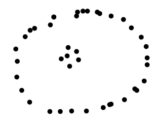
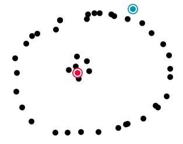
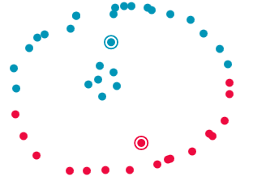
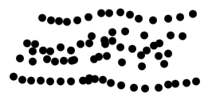
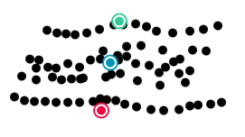
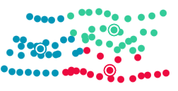
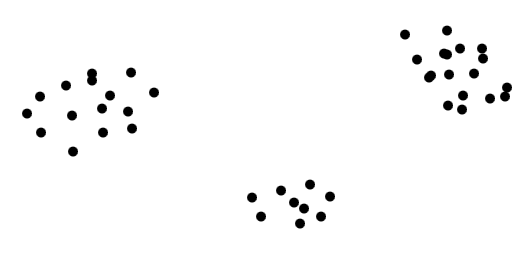
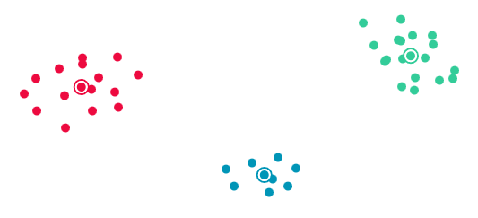
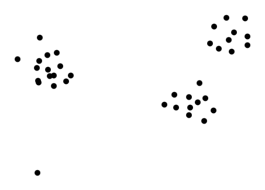
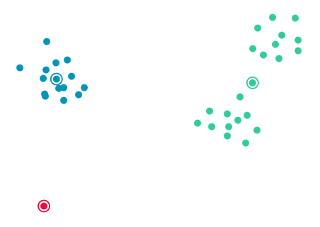

<!-- Made with marpee: https://github.com/msetzu/marpee -->
<!-- Made with marp: https://marp.app -->

<!-- Fonts -->
<link rel="preconnect" href="https://fonts.googleapis.com">
<link rel="preconnect" href="https://fonts.gstatic.com" crossorigin>
<link href="https://fonts.googleapis.com/css2?family=Poppins:ital,wght@0,100;0,200;0,300;0,400;0,500;0,600;0,700;0,800;0,900;1,100;1,200;1,300;1,400;1,500;1,600;1,700;1,800;1,900&display=swap" rel="stylesheet">
<link href="https://fonts.googleapis.com/css2?family=Inconsolata:wght@200..900&display=swap" rel="stylesheet">
<link href="https://fonts.googleapis.com/css2?family=Raleway:ital,wght@0,100..900;1,100..900&display=swap" rel="stylesheet">
<link href="https://fonts.googleapis.com/css2?family=Arvo:ital,wght@0,400;0,700;1,400;1,700&display=swap" rel="stylesheet">

<!-- Semantic UI -->

<link
    rel="stylesheet"
    href="https://cdn.jsdelivr.net/npm/semantic-ui@2.5.0/dist/semantic.min.css">
<link
    rel="stylesheet"
    type="text/css",
    href="https://cdn.jsdelivr.net/gh/msetzu/marpee@latest/assets/libs/semanticui/override.css">

<!-- Mermaid -->

<link
    rel="stylesheet"
    type="text/css",
    href="https://cdn.jsdelivr.net/gh/msetzu/marpee@latest/assets/libs/mermaid/mermaid.css">

<!-- Theme -->
<link
    rel="stylesheet"
    type="text/css",
    href="https://cdn.jsdelivr.net/gh/msetzu/marpee@latest/css/themes/base.css">
<link
    rel="stylesheet"
    type="text/css",
    href="https://cdn.jsdelivr.net/gh/msetzu/marpee@latest/css/themes/unipi.css">
<link
    rel="stylesheet"
    type="text/css",
    href="https://cdn.jsdelivr.net/gh/msetzu/marpee@latest/css/themes/colors.css">

<!-- Slide size -->
<link
    rel="stylesheet"
    type="text/css",
	href="https://cdn.jsdelivr.net/gh/msetzu/marpee@latest/css/scaling/px1280_720.css">

<link
    rel="stylesheet"
    type="text/css",
	href="https://cdn.jsdelivr.net/gh/msetzu/marpee@latest/css/scaling/sizing.css">

<!-- paginate: skip -->

# Clustering: K-Means

---

<!-- paginate: true -->

# K-means: centroids

K-Means is designed to operate on *centroids* in a Euclidean space. A cluster $C_i$ is defined by its centroid $c_i$: all instances $x_i, \dots, x_j$ which are closer to $c_i$ than any other $c_{j \neq i}$, are part of its cluster.  For a set of $k$ centroids $c_1, \dots, c_k$, cluster $C_i$ with centroid $c_i$ is 
$$
C_i = \{ x \in X \mid c_i = arg\min_{c \in \{c_1, \dots, c_k\}} || c - x ||_2^2 \}.
$$
Equivalently,
$$
C_i = \{ x \in X \mid \forall j \neq i. || c_i - x ||_2^2 \leq || c_j - x ||_2^2 \}.
$$

---

# K-means: Voronoi tessellation

In other words: the centroids of a clustering tesselate the space with a Voronoi tessellation!

A Voronoi tessellation. Courtesy of Balu Erti (CC BY-SA).

---

# K-means: distance

The Voronoi tesselation implies several properties of the resulting clustering: 

- Convexity
- Nesting obliviousness
- Density obliviousness
- Outlier sensitivity

We'll look at it through an [execution](https://hckr.pl/k-means-visualization/).

---

# K-means: convexity

By definition, cells in a Voronoi tessellations in Euclidean spaces are convex.

A Voronoi tessellation of a set of records (in black). Courtesy of Balu Erti (CC BY-SA).

---

# K-means: nesting obliviousness

An Euclidean space means that the tessellation (and thus the clusters) are convex polytopes: this implies that **cluster nesting is impossible**!

Clustering of two nested sets of points with two centroids (in red and blue).

---

# K-means: density obliviousness

Voronoi tessellations are density-oblivious: density does not play a role.

Clustering of three sets of points on a "road" pattern with three centroids (in red, blue, and green).

---

# K-means: outlier sensitivity

Voronoi tesselation are sensitive to outliers: a single unfortunately placed instance can change drastically the clustering.

Clustering of three sets of points on with three centroids (in red, blue, and green): no outliers (top), with outlier (bottom).

---

# K-means: the algorithm

Centroids are *learned*, not given!

1. Initialize a set of $k$ centroids $c_1, \dots, c_k$
2. Induce clusters $C_1, \dots, C_k$ by (squared) Euclidean norm
3. Update centroids as the mean of their clusters: $c_i = \dfrac{1}{| C_i |} \sum\limits_{x \in C_i} x$
4. If the centroids are unchanged, terminate. Otherwise, go back to 2.

---

# Convergence

Step `3.` defines centroids as the mean of their clusters:
$$
c_i = \dfrac{1}{| C_i |} \sum\limits_{x \in C_i} x,
$$

thus, it monotonically reduces the intra-cluster Euclidean norm, and the quality of the clustering. By definition, this steps leads to convergence of the algorithm to a minimum of the following objective:
$$
\min \sum\limits_{c \in \{c_1, \dots, c_k \}} \sum\limits_{x \in C_i } || c_i - x||_2^2. 
$$

---

# (Local) Convergence

Step `3.` relies on the initial centroids given in `1.`. The convergence is assured, but the optimization problem is nonconvex. A trivial solution is to optimize over sets of initial centroids, finding several local minima to compare.

**Random initialization**

Centroids are chosen randomly over the instance set $X$.

**Sparsity initialization** ($k$-means++)

1. Iteratively, sample centroids with probabilities proportional to their distance to previous centroids.
2. Run $k$-means, yielding a set of centroids $\{ \tilde{c}_1, \dots, \tilde{c}_k \}$

---

# Hyperparameters

Other than choosing the initialization strategy, we need to choose the number of clusters $k$. As an hyperparameter, it is optimized via search algorithms, e.g., random search or grid search. Practically, we study the objective, and choose a reasonably small $k$ with low objective, for which larger $k$s yield diminishing returns.

$k$-means objective (often referred to as Sum of Squared Errors or Inertia) vs. $k$. Courtesy of Chire (CC BY-SA).

---

# Computational complexity

The algorithm executes over a number of iterations ($l$), computing pairwise distances between $n$ points and $k$ centroids. Thus, we have a complexity of order of
$$
\mathcal{O}(l n k d),
$$
where $d$ indicates the computational complexity of computing the distance.

---

# What is a centroid, really?

As a centroid defines a cluster, it provides a direct layer of interpretation. It defines the central and representative instance in the cluster, thus it can be used to interpret it.

Moreover, a cluster is a subset of a dataset. Thus, we can (should) data understanding.

---

# Preprocessing

