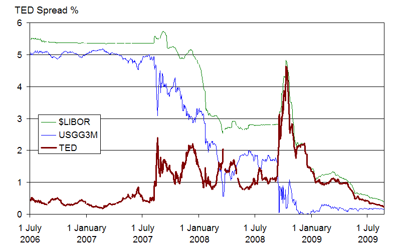
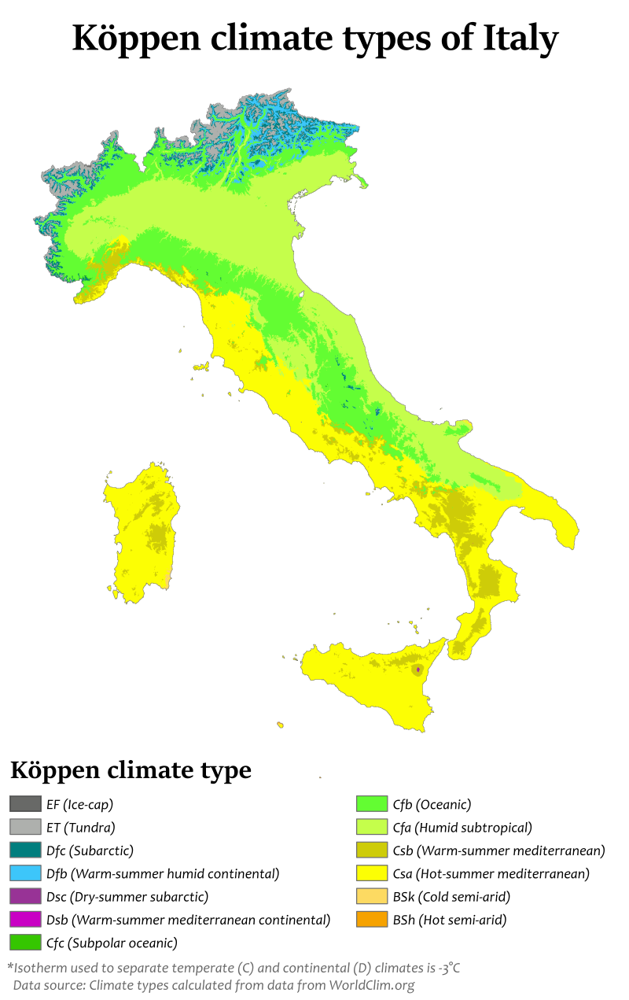
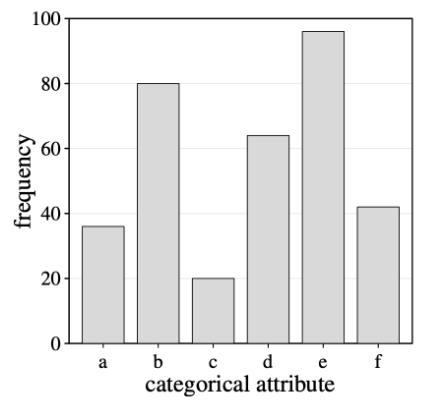
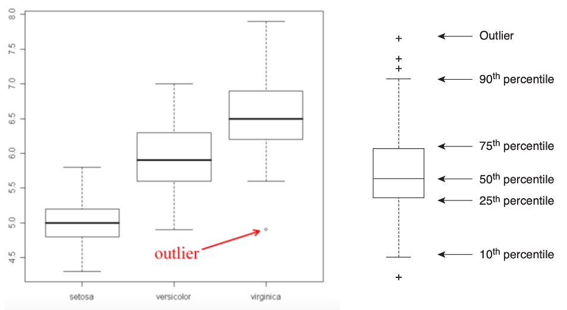
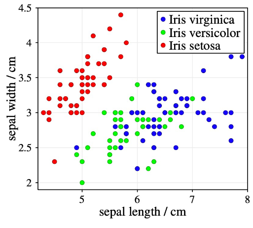
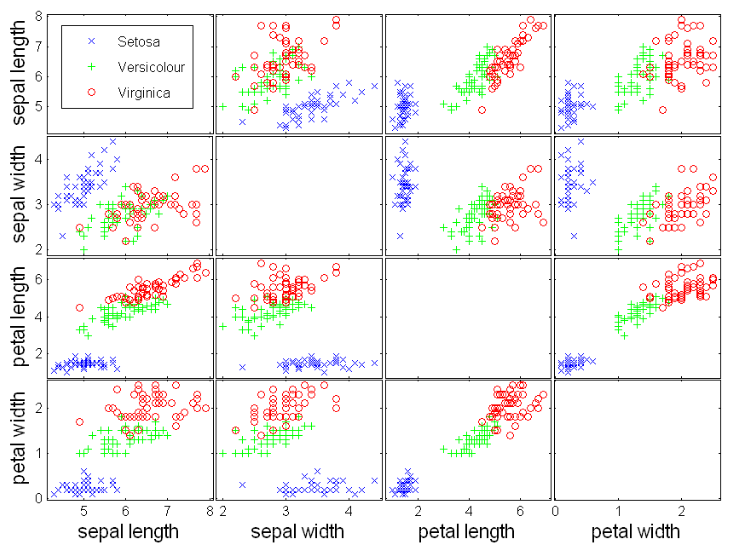

<!-- Made with marpee: https://github.com/msetzu/marpee -->
<!-- Made with marp: https://marp.app -->

<!-- Fonts -->
<link rel="preconnect" href="https://fonts.googleapis.com">
<link rel="preconnect" href="https://fonts.gstatic.com" crossorigin>
<link href="https://fonts.googleapis.com/css2?family=Poppins:ital,wght@0,100;0,200;0,300;0,400;0,500;0,600;0,700;0,800;0,900;1,100;1,200;1,300;1,400;1,500;1,600;1,700;1,800;1,900&display=swap" rel="stylesheet">
<link href="https://fonts.googleapis.com/css2?family=Inconsolata:wght@200..900&display=swap" rel="stylesheet">
<link href="https://fonts.googleapis.com/css2?family=Raleway:ital,wght@0,100..900;1,100..900&display=swap" rel="stylesheet">
<link href="https://fonts.googleapis.com/css2?family=Arvo:ital,wght@0,400;0,700;1,400;1,700&display=swap" rel="stylesheet">

<!-- Semantic UI -->
<script
        src="https://code.jquery.com/jquery-3.1.1.min.js"
        integrity="sha256-hVVnYaiADRTO2PzUGmuLJr8BLUSjGIZsDYGmIJLv2b8="
        crossorigin="anonymous"></script>
<script
    src="https://cdn.jsdelivr.net/gh/msetzu/marpee@latest/assets/libs/semanticui/semantic.min.js"></script>
<link
    rel="stylesheet"
    href="https://cdn.jsdelivr.net/npm/semantic-ui@2.5.0/dist/semantic.min.css">
<link
    rel="stylesheet"
    type="text/css",
    href="https://cdn.jsdelivr.net/gh/msetzu/marpee@latest/assets/libs/semanticui/override.css">

<!-- Mermaid -->
<script
    src="https://cdn.jsdelivr.net/npm/mermaid@10.3.0/dist/mermaid.min.js"></script>
<link
    rel="stylesheet"
    type="text/css",
    href="https://cdn.jsdelivr.net/gh/msetzu/marpee@latest/assets/libs/mermaid/mermaid.css">

<!-- Theme -->
<link
    rel="stylesheet"
    type="text/css",
    href="https://cdn.jsdelivr.net/gh/msetzu/marpee@latest/css/themes/base.css">
<link
    rel="stylesheet"
    type="text/css",
    href="https://cdn.jsdelivr.net/gh/msetzu/marpee@latest/css/themes/unipi.css">
<link
    rel="stylesheet"
    type="text/css",
    href="https://cdn.jsdelivr.net/gh/msetzu/marpee@latest/css/themes/colors.css">

<!-- Slide size -->
<link
    rel="stylesheet"
    type="text/css",
	href="https://cdn.jsdelivr.net/gh/msetzu/marpee@latest/css/scaling/px1280_720.css">

<link
    rel="stylesheet"
    type="text/css",
	href="https://cdn.jsdelivr.net/gh/msetzu/marpee@latest/css/scaling/sizing.css">

<!-- paginate: skip -->

# Data Mining
*309AA*

---

<!-- paginate: true -->

# Class, meet Data

Data comes from diverse sources, and generally is not tailor-made for some downstream task. We need to start from basics:

- What features are available?
- What are they measuring, exactly?
- What properties do they have?
- What are their relations?
- Are there outliers?
- ...

---

# Data, in all shapes and sizes

Data can be of different nature:
- Temporal: the data describes events *over time*
- Sequential: the data spans some ordering
- Relational: the data describes event *in between instances*
- Spatial: the data describes space
- Independent: instances in data are independent observations

These can co-occur!

---

# Shapes in our thought exercise

You are given a cycling data collection, with data gathered from different sources, covering all tours of thousands of cyclists from 2018 to 2024.

<div class="ui two column doubling stackable grid container bottom">
<div class="column">

**Data**

- Speed
- Cadence
- Bike used
- Track, e.g., length, elevation, climbs
- Info on the cyclist, e.g., age

</div>
<div class="column">

**Shapes**

- Independent: each activity is independent of the others
- Temporal: speed at each point in a given activity
- Sequential: the sequence of climbs in an activity
- Relational: groups of cyclists riding together
- Spatial: the GPX data itself

</div>
</div>

<!-- footer: "A GPX file gathers all GPS points, tracing movements on a map." -->

---

# Categorizing data collections

We refer to single instances in the collections as *objects/records/instances*, which are described by attributes.

<div class="ui two column doubling stackable grid container bottom">
<div class="column">

| Id  | Age | Income | Marital | Loan grant |
| --- | --- | ------ | ------- | ---------- |
| 0   | 30  | 2.5k   | Married | Yes        |
| 1   | 24  | 1.4k   | Single  | No         |
| ... | ... | ...    | ...     | ...        |

</div>
<div class="column">

Attributes: `Id`, `Age`, `Income`, `Marital`, `Loan grant`
Records: `0, 30, 2.5k, Married, Yes`, `1, 24, 1.4k, Single, No`

</div>
</div>

<!-- footer: "Attributes are often also called 'features', 'variables' in other fields, e.g., machine learning or statistics." -->

---

# Data understanding

After we have the gathered data, before cleaning and processing it, we need to understand it.

We start with the data and feature types, and how they are often represented.

<!-- footer: "" -->

---

# Data types: Tabular

When records are independent, and described by the same finite set of features, they are often represented in a *tabular* form: the *data matrix*. Each row is a record, each dimension is an attribute.

| Id  | Age | Bike used    | Length | Duration | Date      | Cyclist         |
| --- | --- | ------------ | ------ | -------- | --------- | --------------- |
| 0   | 28  | Colnago VRS4 | 152.4  | 3:43:12  | 15-5-2025 | Alessandro Covi |
| 1   | 40  | Cervelo RS5  | 72.4   | 2:55:01  | 4-3-2024  | Gianni Affino   |

Records on the rows, attributes on the columns.

<!-- footer: "" -->

---

# Data types: Transaction

A feature contains a (multi)set of *items*.

| Purchase Id | Cart                         | Bought on       |
| ----------- | ---------------------------- | --------------- |
| 0           | Bread, Milk                  | 17:12-15-5-2025 |
| 1           | Notebook, Pens, Bread, Basil | 8:04-4-3-2024   |

Records on the rows, attributes on the columns.

<!-- footer: "Not to be confused with transactional data, which instead refers to data about transactions, e.g., stock market purchases." -->

---

# Data types: Graph

Data is linked, either on records or features.


<div class="caption">

A simplified view of the Wikipedia knowledge graph on Mona Lisa.

</div>

Records are nodes in a graph, attributes can vary wildly across records.

<!-- footer: "" -->

---

# Data types: Sequential

Records are sequences (of variable length): attributes are indexed (order or time).

<div class="ui two column doubling stackable grid container bottom">
<div class="column">

**Order**

```
Nel mezzo del cammin di nostra vita
mi ritrovai per una selva oscura,
ché la diritta via era smarrita.
```
```
GAA
GAG
```
<div class="caption">

Start of the Divina Commedia (top) and codons synthesizing Glutamic acid (bottom).

</div>
</div>
<div class="column">

**Time**


<div class="caption">

Risk in the financial system over time. Courtesy of Lawrence Khoo (Wikimedia).

</div>
</div>
</div>

---

# Data types: Spatial

<div class="ui two column doubling stackable grid container bottom">
<div class="column">

Attributes are replaced by spatial indexing.

</div>
<div class="column">

<div class="caption">

Climate types of Italy. Courtesy of Adam Peterson (Wikidata). CC BY-SA 4.0.

</div>
</div>
</div>

---

# Attributes have types too!

| Type            | Description                                                         | Example              |
| --------------- | ------------------------------------------------------------------- | -------------------- |
| **Numerical**   | Values have a total ordering, and represent some numerical quantity | Age, dates           |
| **Ordinal**     | Values have a total ordering, and represent some quantity           | Dress size, Cup size |
| **Binary**      | Values are one of two categories: no ordering                       | Boolean values       |
| **Categorical** | Values of one of multiple categories: no ordering                   | Country, Job         |

---

# Attributes have types too!

| Type            | Operations                                                      | Example      |
| --------------- | --------------------------------------------------------------- | ------------ |
| **Numerical**   | Standard mathematical operators and functions                   | Mean, Max, + |
| **Ordinal**     | Standard mathematical operators and functions, when appropriate | Max          |
| **Binary**      | Equality operators                                              | $=, \neq$    |
| **Categorical** | Equality operators                                              | $=, \neq$    |

---

# Values have types too!

Values are either:

<div class="ui two column doubling stackable grid container bottom">
<div class="column">

**Discrete**

Defined in a finite or countably finite domain, e.g., country, job, cup size. Note: ordinal values may be discrete too!

</div>
<div class="column">

**Continuous**

Defined in a continuous and infinite domain, e.g., distance.

</div>
</div>

---
# Data syntax and semantics

Given the categorization of the records and attributes of your data, we can study its general behavior. We leverage some basic statistical tools, first of all by drawing the empirical distribution of the attributes.

<div class="ui two column doubling stackable grid container bottom">
<div class="column">

<div class="caption">

Estimated distribution  of a continuous attribute.

</div>
</div>
<div class="column">

<div class="caption">

Distribution  of a categorical attribute in a bar chart.

</div>
</div>
</div>


---

# Data semantics: useful statistics

<div class="ui two column doubling stackable grid container bottom" style="width: 50%;">
<div class="column">

**Expected value**

A statistic representative of the value of an attribute, weighing values and their probability

</div>
<div class="column">

**Variance**

Distance from the expected value of all records: the data spread

</div>
</div>

<div class="ui two column doubling stackable grid container bottom" style="width: 50%;">
<div class="column">

**Quantiles**

Inflection points defining values for a threshold, e.g., if the 99-th percentile is $84$, then we expect $99\%$ of values to be below $84$

</div>
<div class="column">

**Interquantile range**

Distance between quantiles: how spread are inflection points?

</div>
</div>


---
# Data semantics: useful statistics


<div class="ui two column doubling stackable grid container bottom" style="width: 50%;">
<div class="column">

Expected value

$$\mathbb{E}[X] = \sum_{x \in dom(X)} \Pr(X = x) x$$

</div>
<div class="column">

Variance

$$\sigma^2(X) = \mathbb{E}[\Sigma_{x \in dom(X)} (x - \mathbb{E[X]})^2]$$

</div>
</div>

<div class="ui two column doubling stackable grid container bottom" style="width: 50%;">
<div class="column">

Quantile

$$q^p = x s.t. \Pr(X \leq x) = q^p$$

</div>
<div class="column">

Interquartile range

$$q^{75} - q^{25}$$

</div>
</div>


<!-- footer: "Discrete case. The continuous case is analogous with integrals." -->

---

# Data semantics: useful statistics


<div class="caption">

A Normal distribution, its $q^{25}$ and $q^{75}$ quantiles, and interquartile range between them. On top, a box plot visualization of the distribution.

</div>

<!-- footer: "" -->

---

# Data semantics: closing tips

- Statistical summary of the distribution are typically accompanied by visual and semantic one
- Erroneous or weird values, to be cleaned later can already pop up in these basic steps
- Outlier values typicall skew statistics. Variance is often replaced by absolute/median average deviation

<!-- footer: "" -->


---

# Data understanding in the KDD loop

Determine the...
1. ... shape of your data
2. ... attributes of your data
3. ... types of your attributes
4. ... semantics of your attributes


<div class="caption">

The knowledge discovery pipeline, step 1.

</div>

We need to **clean** our data!

---

# Data cleaning: sources of problems

**Data accuracy**
- Syntactic: values outside domain, e.g., Eataly in Country
- Semantic: values in domain, but semantically wrong, e.g., age is 3, and weight is 82kg

**Completeness**
Some attributes are not collected, or are collected partially, e.g., temperature was not recorded by the sensor.

**Biased gathering**
Records may over/under-representative, e.g., the bank may only provide data about successful loan applicants.

**Timeliness**
Data is not up to date.

---

# Data cleaning

Remember: **garbage in, garbage out**! In a task-agnostic view, we are interested in addressing the above by tackling:

- Duplicates: skews the data distribution
- Missing values: give false/partial information
- Noise: uninformative of the data
- Poor accuracy: gives wrong data
- Outliers: skews the data distribution and models of the data

---

# Dealing with... duplicates

Trivial: remove them... when appropriate! Not all duplicates are garbage, it depends on what insight you can gather from it.

<div class="ui two column doubling stackable grid container bottom">
<div class="column">

**Case A**

You have data on registration to your website, with several duplicate e-mails.

Insights:
- The "Sign in" button is hard to find
- The "Sign in" button is less visible than the "Sign up" button
- Your site is so anonymous people forget they signed up already

</div>
<div class="column">

**Case B**

You have data on credit account opening from Poste (Italian postal service) with several duplicate e-mails.

Insights:
- The client hacked the database and added themselves to ask more credit (unlikely)
- Poste's tech staff is underwhelming (very likely)

</div>
</div>

---

# Dealing with... duplicate features?

<div class="ui two column doubling stackable grid container bottom">
<div class="column w60">

Features convey similar, although not equal, information to others.

- Resting heart rate and heart rate under continuous high effort
- Education level and reading skills
- Rent and available bank deposit

These pairs of features are not per se one duplicate of the other, but are strongly related: when one grows, so does the other, and when one goes down, so does the other.


</div>
<div class="column w35">

<div class="caption">

Correlation between two features: as one grows, so does the other.

</div>
</div>
</div>


---

# Dealing with... duplicates?

Linear (and rank) relationships between two features $X, Y$ can be quantified with their correlation. Correlation ranges in $[-1, +1]$, from perfectly negative to perfectly positive correlation.

Given two lists of values ${x^i}^n, {y^i}^n$, we can compute two main correlation types.

<div class="ui two column doubling stackable grid container bottom">
<div class="column">

**Pearson**
Purely numerical, applicable to numeric features.


$\rho_P^{X, Y} = \dfrac{\mathbb{E}[(x^i - \mathbb{E}[X])(y^i - \mathbb{E}[Y])]}{\sigma_X \sigma_Y}$


</div>
<div class="column">

**Spearman**
Pearson, applied to the *rank* of feature values, i.e., their relative position within their values.

$\rho_S = \rho_P^{rank(X), rank(Y)}$


</div>
</div>


---

# Dealing with... missing values

Data may be missing for any number of reasons (at random or not at random).

1. A record has a large and/or significant set of missing attributes
2. An attribute has a large percentage of missing values

We have two choices: dropping or imputing.

---

# Dealing with... missing values

<div class="ui segment VS">
<div class="ui two column very relaxed grid">
<div class="column">

**Dropping**

- High percentage of missing values
- Missing values in critical attributes, e.g., a patient in cardiology has no heart rate data

</div>
<div class="column">

**Imputing**

- Low percentage of missing values
- Reasonably good understanding of the attribute semantics/distribution
- Presence of related attributes

We create a model to *predict* the missing value

</div>
</div>
<div class="ui vertical divider">
VS
</div>
</div>


---

# Dealing with... outliers

Quantiles and distributions inform us on what values may be outlier. They are typically dropped, and unlike missing values, almost never imputed.

We'll tackle algorithms later in the course.

---
# From number to pictures: visualization

Yet another example: Iris dataset detailing the sepal length and widths, and petal length and width of 150 Iris Setosa, Iris Versicolor, Iris Virginica.

<div class="ui two column doubling stackable grid container bottom">
<div class="column w60">

| Sepal L. | Sepal W. | Petal L. | Petal W. | Type       |
| -------- | -------- | -------- | -------- | ---------- |
| 5.1      | 3.5      | 1.4      | 0.2      | Setosa     |
| 7.0      | 3.2      | 4.7      | 1.4      | Versicolor |
| ...      | ...      | ...      | ...      | ...           |

</div>
<div class="column w35">

<div class="caption">

The three Iris types in the dataset.

</div>
</div>
</div>

---

# Box plot

Plot univariate date, eyeing outliers.


<div class="caption">

A box plot of the sepal length in the Iris dataset. The bold bar indicates the mean value, the box $q^{25}$ and $q^{75}$, the bars  $q^{10}$ and $q^{90}$. Remaining instances are represented as circles.

</div>

---

# Scatter plot

Plot bivariate (or trivariate) data, eyeing data correlation and outliers.


<div class="caption">

A scatter plot of the sepal length and width in the Iris dataset.

</div>

---

# Scatter plot

Plot bivariate (or trivariate) data, eyeing data correlation and outliers.


<div class="caption">

A scatter matrix: scatter plots of all pairs of attributes in the Iris dataset.

</div>
